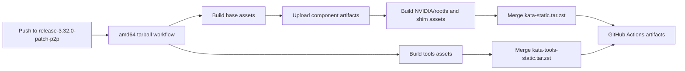

# Building the NVIDIA P2P-patched Kata release

## Purpose and scope

`release-3.32.0-patch-p2p` is a release branch based on upstream Kata
Containers `3.32.0`. It carries a small, release-specific NVIDIA patch set and
is not a replacement for Kata's upstream GPU-passthrough support.

The patch set changes the *guest NVIDIA driver source used while building the
NVIDIA GPU kernel and rootfs*. It does not change QEMU/VFIO topology, IOMMU or
ACS policy, CUDA peer-access policy, or the physical PCIe fabric. Those remain
host and deployment concerns. A successful build therefore means that the
patched driver has been packaged; it does not by itself prove that every GPU
pair can perform P2P transfers.

## What changed from upstream 3.32.0

The branch contains the following functional changes.

1. `versions.yaml` pins the NVIDIA driver to `595.58.03` and changes its
   source from NVIDIA's public tag archive to this repository's internal
   release asset:

   ```text
   https://github.com/rongxinzy/kata-containers/releases/download/
   internal-driver-595.58.03-p2p/595.58.03.tar.gz
   ```

   That asset is the P2P-patched driver source consumed by the kernel build.
   Its release is available at
   [Internal NVIDIA Driver Source 595.58.03-p2p](https://github.com/rongxinzy/kata-containers/releases/tag/internal-driver-595.58.03-p2p).

2. `tools/packaging/kernel/build-kernel.sh` recognizes GitHub Release asset
   URLs. When `GITHUB_TOKEN` is present, it resolves the named asset through
   GitHub's Releases API and downloads it with the binary-media API. It still
   supports the unauthenticated direct-download path for normal public URLs.
   The downloaded driver archive must be non-empty and have MIME type
   `application/gzip` before extraction.

3. The token is passed through both container boundaries used by the build:
   `tools/packaging/static-build/kernel/build.sh` passes it into the kernel
   builder container, and
   `tools/packaging/kata-deploy/local-build/kata-deploy-binaries-in-docker.sh`
   passes it into the kata-deploy build container. GitHub Actions supplies the
   short-lived `secrets.GITHUB_TOKEN`; a local private-release build needs a
   token with permission to read the release asset.

4. The NVIDIA rootfs's chiselled `iptables` installation now creates the
   `iptables` and `ip6tables` links in addition to the existing
   `iptables-restore` and `iptables-save` links. This keeps the GPU rootfs
   command surface complete.

5. `.github/workflows/build-kata-static-tarball-amd64.yaml` listens for pushes
   to `release-3.32.0-patch-p2p` and injects `secrets.GITHUB_TOKEN` into each
   base asset build. This is essential for the private P2P driver asset.

## Build pipeline



The entry point is
`.github/workflows/build-kata-static-tarball-amd64.yaml`. A normal branch push
uses `stage=test` and `push-to-registry=no`.

1. The `build-asset` matrix runs `make "<asset>-tarball"` for core amd64
   assets, including `kernel-nvidia-gpu`. `GITHUB_TOKEN` reaches the kernel
   build, which fetches the P2P-patched `595.58.03.tar.gz` source and packages
   the resulting kernel and modules.
2. Each base result is uploaded as a
   `kata-artifacts-amd64-<asset>` artifact. Rootfs and shim jobs download the
   prerequisite artifacts, install them as prebuilt inputs, and build their
   dependent tarballs.
3. `create-kata-tarball` downloads the component artifacts and runs
   `kata-deploy-merge-builds.sh`, producing `kata-static.tar.zst`. The
   `create-kata-tools-tarball` job similarly produces
   `kata-tools-static.tar.zst`.
4. The workflow checks that each merged tarball is below GitHub's 2 GiB release
   asset limit, then uploads it as an Actions artifact.

The successful validation run for this branch is
[CI run 30889932305](https://github.com/rongxinzy/kata-containers/actions/runs/30889932305).

## Where to find artifacts

### Driver source

The P2P-patched driver source is a repository Release asset, not an Actions
artifact. Its canonical location is:

```text
https://github.com/rongxinzy/kata-containers/releases/download/
internal-driver-595.58.03-p2p/595.58.03.tar.gz
```

### CI build output

Open the relevant GitHub Actions run and use its **Artifacts** section. A
branch-push build has no suffix, so the principal downloadable artifacts are:

- `kata-static-tarball-amd64` — merged Kata release tarball containing the
  runtime/build outputs.
- `kata-tools-static-tarball-amd64` — merged tools tarball.
- `kata-artifacts-amd64-kernel-nvidia-gpu` and
  `kata-artifacts-amd64-kernel-nvidia-gpu-modules` — the NVIDIA kernel and its
  modules, when retained by the dependency graph.
- Other `kata-artifacts-amd64-*` and `kata-tools-artifacts-amd64-*` entries —
  individual intermediate component tarballs.

These artifacts have a configured retention period of **15 days**. They are
appropriate for validation and hand-off, not as a permanent release channel.

### Registry images and GitHub Releases

The branch-push workflow does **not** publish an OCI image, a package, or a
GitHub Release: `push-to-registry` defaults to `no`. The reusable
`release-amd64.yaml` and `publish-kata-images.yaml` workflows can publish
artifacts and payload images when called with `push-to-registry=yes` and the
required registry secrets. They are not currently wired to this P2P branch.

Before claiming a production release, add and review an explicit P2P release
caller that chooses immutable tags, registry destinations, and release assets.
Do not treat a successful branch-push CI run as publication.

## Triggering and re-running CI

### Automatic trigger

Any pushed commit on the release branch starts the amd64 tarball workflow:

```bash
git switch release-3.32.0-patch-p2p
git commit -am "describe the release change"
git push origin release-3.32.0-patch-p2p
```

The workflow has `push` and `workflow_call` triggers; it does not expose a
`workflow_dispatch` trigger. Therefore, use a new push to start a fresh run,
or use GitHub Actions' **Re-run all jobs** action for an existing run.

### Reusable-workflow trigger

Another repository workflow may call the amd64 builder through
`workflow_call`. The caller can set `stage`, `tarball-suffix`,
`push-to-registry`, `commit-hash`, and `target-branch`, and must provide the
declared secrets. Use this only from a reviewed release caller: setting
`push-to-registry=yes` changes the build from validation to publication.

## Local reproduction

For a local NVIDIA build, disable the CI artifact cache so the P2P-patched
driver source is actually consumed:

```bash
export USE_CACHE=no
export GITHUB_TOKEN=<token-with-release-read-access>
cd tools/packaging/kata-deploy/local-build
make kernel-nvidia-gpu-tarball
make rootfs-image-nvidia-gpu-tarball
```

The resulting tarballs are written below the local `build/` directory. For
deployment instructions and the requirement that the kernel and rootfs come
from the same build, see
[Building and Deploying Local Kata Artifacts](how-to-build-and-deploy-local-artifacts.md).

## P2P runtime validation

After deploying a matching kernel and rootfs to a GPU-passthrough host, verify
the environment separately. At minimum, inspect GPU topology and peer-access
visibility with `nvidia-smi topo -m` and `nvidia-smi topo -p2p`, then run a
real CUDA P2P or NCCL workload. Record host PCIe topology, ACS/IOMMU settings,
and guest results with the artifact version. The build pipeline packages the
patched source; the host topology determines whether P2P is usable at runtime.
